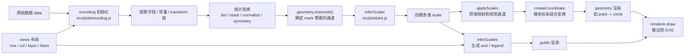
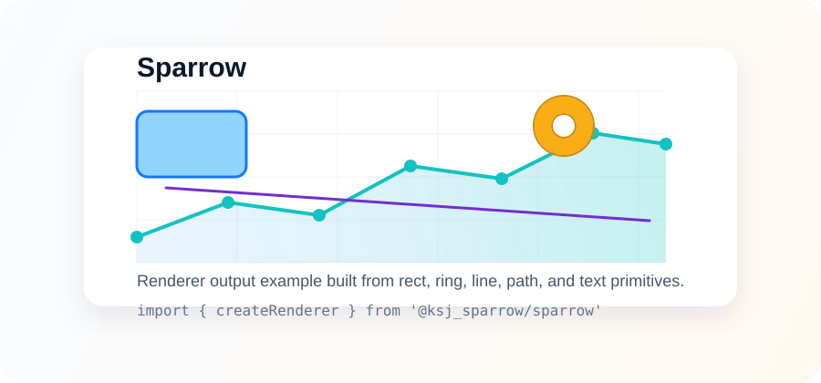

```mermaid
flowchart TD
    A["npm 包入口\nsrc/index.js"] --> B["createRenderer\nsrc/renderer/renderer.js"]

    subgraph P["对外稳定发布层"]
      A
      B
    end

    subgraph R["Renderer 渲染层"]
      B --> R1["context\n创建 svg / g\nsrc/renderer/context.js"]
      B --> R2["shape\nline / rect / circle / path / text / ring\nsrc/renderer/shape.js"]
      B --> R3["transform\ntranslate / rotate / scale / save / restore\nsrc/renderer/transform.js"]
      B --> R4["animate\ntween / sequence / stagger\nsrc/renderer/animate.js"]
      R1 --> R2
      R1 --> R3
    end

    subgraph C["Coordinate 坐标变换层"]
      C0["createCoordinate\nsrc/coordinate/coordinate.js"]
      C1["cartesian\nsrc/coordinate/cartesian.js"]
      C2["polar\nsrc/coordinate/polar.js"]
      C3["transpose\nsrc/coordinate/transpose.js"]
      C4["基础 transforms\nsrc/coordinate/transforms.js"]
      C1 --> C4
      C2 --> C4
      C3 --> C4
      C0 --> C1
      C0 --> C2
      C0 --> C3
    end

    subgraph S["Scale 比例尺层"]
      S0["scale index\nsrc/scale/index.js"]
      S1["linear / log / time"]
      S2["ordinal / band / point"]
      S3["quantile / quantize / threshold"]
      S4["tickStep / nice / ticks\nsrc/scale/utils.js"]
      S0 --> S1
      S0 --> S2
      S0 --> S3
      S1 --> S4
    end

    subgraph G["Geometry 图元层"]
      G0["point mark\nsrc/geometry/point.js"]
      G1["channel 定义\nsrc/geometry/channel.js"]
      G2["channelStyles\nsrc/geometry/style.js"]
      G0 --> G1
      G0 --> G2
    end

    subgraph T["Statistic 统计变换层"]
      T0["bin\nsrc/statistic/bin.js"]
      T1["stack\nsrc/statistic/stack.js"]
      T2["normalize\nsrc/statistic/normalize.js"]
      T3["symmetry\nsrc/statistic/symmetry.js"]
    end

    subgraph U["Guide 引导层"]
      U0["axisX / axisY\nsrc/guide/axisX.js\nsrc/guide/axisY.js"]
      U1["axis 公共逻辑\nsrc/guide/axis.js"]
      U2["ticks / grid\nsrc/guide/ticks.js\nsrc/guide/grid.js"]
      U3["legendRamp / legendSwatches"]
      U0 --> U1
      U1 --> U2
      U3 --> U1
    end

    subgraph V["Views 视图布局层"]
      V0["createViews\nsrc/views/view.js"]
      V1["row / col\nsrc/views/flex.js"]
      V2["layer\nsrc/views/layer.js"]
      V3["facet\nsrc/views/facet.js"]
      V0 --> V1
      V0 --> V2
      V0 --> V3
    end

    subgraph L["Plot 图形语法层"]
      L0["create\nsrc/plot/create.js"]
      L1["initialize / encoding\nsrc/plot/encoding.js"]
      L2["inferScales / applyScales\nsrc/plot/plot.js"]
      L3["inferGuides\nsrc/plot/guide.js"]
      L4["geometry encoding helper\nsrc/plot/geometry.js"]
      L0 --> L1
      L1 --> L4
      L1 --> T0
      L1 --> T1
      L1 --> T2
      L1 --> T3
      L2 --> S0
      L3 --> U0
      L3 --> U3
    end

    L1 --> G0
    L2 --> C0
    G0 --> B
    U0 --> B
    U3 --> B
    V0 --> L0

```

模块调用关系

# Sparrow

Lightweight SVG renderer and visualization primitives.

Sparrow is a small front-end rendering library centered around an SVG renderer.
The published package exposes a stable core built around `createRenderer`,
plus reusable coordinate, scale, and statistic primitives.



## Install

```bash
npm install @ksj_sparrow/sparrow
```

or

```bash
pnpm add @ksj_sparrow/sparrow
```

## Quick Start

```js
import { createRenderer } from '@ksj_sparrow/sparrow'

const renderer = createRenderer(420, 240)

renderer.rect({
  x: 24,
  y: 24,
  width: 140,
  height: 82,
  fill: '#91d5ff',
  stroke: '#1677ff',
  strokeWidth: 2
})

renderer.circle({
  cx: 270,
  cy: 76,
  r: 34,
  fill: '#ffd666',
  stroke: '#d48806',
  strokeWidth: 2
})

renderer.line({
  x1: 36,
  y1: 186,
  x2: 364,
  y2: 136,
  stroke: '#722ed1',
  strokeWidth: 3
})

renderer.text({
  x: 210,
  y: 220,
  text: 'Hello Sparrow',
  textAnchor: 'middle',
  fill: '#333',
  fontSize: 18
})

document.querySelector('#app').appendChild(renderer.node())
```

## Browser Example

If you are using Sparrow in a Vite or other ESM-based front-end project, a
minimal page can look like this:

```html
<div id="app"></div>

<script type="module">
  import { createRenderer } from '@ksj_sparrow/sparrow'

  const renderer = createRenderer(320, 180)
  renderer.rect({
    x: 20,
    y: 20,
    width: 120,
    height: 70,
    fill: '#b7eb8f',
    stroke: '#389e0d',
    strokeWidth: 2
  })
  renderer.text({
    x: 160,
    y: 150,
    text: 'Rendered in the browser',
    textAnchor: 'middle',
    fill: '#333'
  })

  document.getElementById('app').appendChild(renderer.node())
</script>
```

## API Overview

`createRenderer(width, height)` returns an SVG renderer instance with these
core methods:

- `line(options)`
- `rect(options)`
- `circle(options)`
- `text(options)`
- `path(options)`
- `ring(options)`
- `translate(tx, ty)`
- `rotate(theta)`
- `scale(sx, sy)`
- `save()`
- `restore()`
- `animate(element, from, to, options)`
- `tween(options)`
- `sequence(steps)`
- `stagger(items, factory, options)`
- `node()`
- `group()`

In addition to the renderer, the package also exposes these stable building
blocks from the root entry:

- Coordinate: `createCoordinate`, `cartesian`, `polar`, `transpose`
- Scale: `createLinear`, `createLog`, `createTime`, `createBand`,
  `createPoint`, `createOrdinal`, `createQuantile`, `createQuantize`,
  `createThreshold`, `createIdentity`, `interpolateNumber`,
  `interpolateColor`
- Statistic: `createBinX`, `createNormalizeY`, `createStackY`,
  `createSymmetryY`

Example:

```js
import {
  createRenderer,
  polar,
  createLinear,
  createStackY
} from '@ksj_sparrow/sparrow'

const angle = createLinear({
  domain: [0, 100],
  range: [0, 1]
})

const coordinate = polar({
  startAngle: -Math.PI / 2,
  endAngle: (Math.PI / 2) * 3,
  innerRadius: 0,
  outerRadius: 1
})

const stackY = createStackY()
```

## Notes

- `node()` returns the root `<svg>` element, which you can append directly to
  the DOM.
- `group()` returns the current `<g>` element used for drawing.
- `rect()` supports negative `width` and `height` values by normalizing the
  final SVG attributes.
- `path()` accepts an array-based path DSL such as
  `[['M', 0, 0], ['L', 100, 100], ['Z']]`.
- `save()` and `restore()` let you isolate transforms on nested `<g>` groups.

## Package Scope

This npm package currently exposes the following stable public APIs from the
root entry:

```js
import {
  createRenderer,
  createCoordinate,
  cartesian,
  polar,
  transpose,
  createLinear,
  createIdentity,
  createOrdinal,
  createBand,
  createPoint,
  createQuantile,
  createThreshold,
  createQuantize,
  createTime,
  createLog,
  interpolateNumber,
  interpolateColor,
  createBinX,
  createNormalizeY,
  createStackY,
  createSymmetryY
} from '@ksj_sparrow/sparrow'
```

The root entry keeps a smaller stable surface focused on renderer,
coordinate, scale, and statistic primitives. Higher-level modules such as
plot, guide, and views are additionally exposed through subpath imports so
they can evolve with clearer boundaries than the root package entry.

## Subpath Imports

The package also ships focused subpath entry points for advanced usage:

```js
import {
  create,
  register,
  initialize,
  inferGuides,
  inferScales,
  applyScales
} from '@ksj_sparrow/sparrow/plot'

import {
  axisX,
  axisY,
  legendRamp,
  legendSwatches
} from '@ksj_sparrow/sparrow/guide'

import { createViews } from '@ksj_sparrow/sparrow/views'
```

These subpaths are useful when you want a narrower public surface instead of
importing everything from the root package entry.

## Development

Requirements:

- Node.js 18+
- pnpm recommended

```bash
pnpm install
pnpm test
pnpm build
pnpm dev
```

Build artifacts are generated in `dist/`.

## License

MIT
